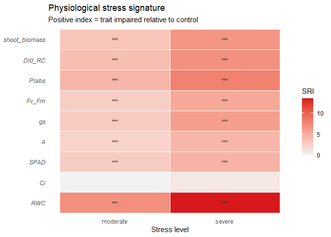
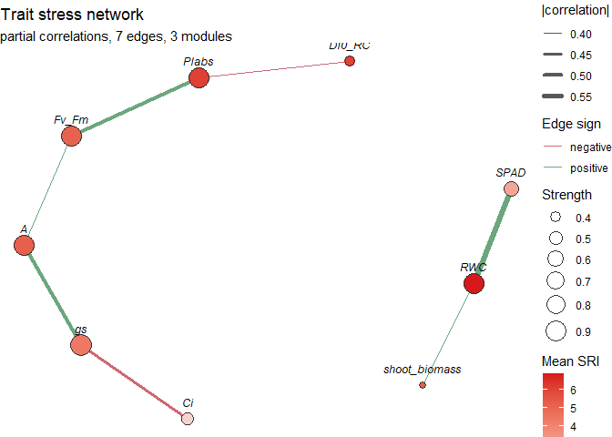

# plantstressR

<!-- badges: start -->

[](https://github.com/agrobioestat/plantstressR/actions/workflows/R-CMD-check.yaml)
<!-- badges: end -->

`plantstressR` answers one question:

> **What is the physiological stress signature of a plant, and how do
> its traits interact?**

You bring one tidy table of physiological traits measured under a
control treatment and one or more stress treatments. The package does
the rest: it puts every trait on a common signed scale, integrates them
into a single rankable index, draws the signature, and maps the network
of traits that respond together.

## Data to try it on

| Data set | What it is for |
|----|----|
| `brachiaria_stress` | Four genotypes, three drought levels, four blocks, 29 traits |
| `wheat_salinity` | Six cultivars at three sites: the multi-environment case |
| `maize_heat` | Small and deliberately messy, to see what the design checks say |

All three are simulated, and documented as such.

## Installation

``` r
# install.packages("remotes")
remotes::install_github("agrobioestat/plantstressR")
```

## The workflow

| Function | What it gives you |
|----|----|
| `validate_stress_data()` | Design checks before anything is computed |
| `calculate_sri()` | A signed, standardized Stress Response Index per trait |
| `integrated_stress_index()` | One weighted index per genotype, plus a ranking |
| `plot_stress_signature()` | The signature as a heat map or a radar plot |
| `stress_network()` | A regularized partial-correlation network with trait modules |
| `stress_module_scores()` | The modules scored with the trait indices |
| `stress_tolerance_index()` | The classical selection indices (`STI`, `SSI`, `GMP`, `TOL`, …) |
| `stress_ordination()` | The sample-level view of the trait space |
| `stress_index_ci()` | Bootstrap limits and rank stability for the ranking |
| `stress_stability()` | Severity and consistency across sites or years |
| `run_plantstress_app()` | The whole workflow in a Shiny dashboard, no code |

Every design function takes `block =` for randomized complete block
designs, and `by =` accepts several columns, so
`by = c("genotype", "site")` covers a multi-environment trial.

## Point and click

If you would rather not write the script at all:

``` r
# install.packages("shiny")
run_plantstress_app()
```

The dashboard loads your CSV, asks which columns are the treatment, the
genotype, the block and the traits, and then gives you the same
signature, ranking, network, ordination and tolerance indices the
functions below produce — every panel is computed by the exported
functions themselves, so anything you see can be reproduced from a
script.

## Example

``` r
library(plantstressR)

traits <- c("Fv_Fm", "PIabs", "DI0_RC", "A", "gs", "Ci", "RWC", "SPAD", "shoot_biomass")

sri <- calculate_sri(
  brachiaria_stress,
  treatment = "drought_level",
  control = "control",
  traits = traits,
  by = "genotype",
  block = "block",
  verbose = FALSE
)

summary(sri)
#> # A tibble: 8 × 8
#>   unit  group    n_traits n_significant mean_sri mean_abs_sri most_impaired
#>   <chr> <chr>       <int>         <int>    <dbl>        <dbl> <chr>        
#> 1 G1    moderate        9             8     2.72         2.72 shoot_biomass
#> 2 G1    severe          9             9     5.23         5.23 shoot_biomass
#> 3 G2    moderate        9             8     2.89         2.89 DI0_RC       
#> 4 G2    severe          9             9     6.41         6.41 RWC          
#> 5 G3    moderate        9             8     2.76         2.76 gs           
#> 6 G3    severe          9             9     6.43         6.43 gs           
#> 7 G4    moderate        9             8     4.16         4.16 Fv_Fm        
#> 8 G4    severe          9             9     9.13         9.13 Fv_Fm        
#> # ℹ 1 more variable: most_resilient <chr>
```

Positive values always mean *stress impaired this trait*, whichever
direction the trait moves. `Fv/Fm` falling and `DI0/RC` rising are both
damage, and `trait_directions()` keeps that bookkeeping straight.

`block = "block"` is what makes this a blocked analysis: each trait is
fitted as `trait ~ treatment + block` within the genotype, so the
variation between replicates leaves the scale instead of diluting the
effect. Drop the argument and you get the completely randomized reading
of the same table.

Rank the genotypes:

``` r
integrated_stress_index(sri, weights = "precision")
#> <plantstress_isi>
#>   Weighting: precision
#>   Aggregate: mean
#>   Ranking:   tolerance (rank 1 = most tolerant)
#> # A tibble: 8 × 6
#>   unit  group      isi isi_scaled n_traits  rank
#>   <chr> <chr>    <dbl>      <dbl>    <int> <dbl>
#> 1 G3    moderate  2.37       0           9     1
#> 2 G1    moderate  2.74      30.0         9     2
#> 3 G2    moderate  3.01      51.8         9     3
#> 4 G4    moderate  3.61     100           9     4
#> 5 G1    severe    5.14       0           9     1
#> 6 G3    severe    5.32       7.20        9     2
#> 7 G2    severe    6.64      60.1         9     3
#> 8 G4    severe    7.63     100           9     4
```

But is that order real? Resample the trial and find out:

``` r
stress_index_ci(sri, n_boot = 200, seed = 1)
#> <plantstress_isi_ci>
#>   Resamples: 200 of 200 usable
#>   Interval:  95% percentile
#>   Ranking:   tolerance (rank 1 = most tolerant)
#>   p_best = share of resamples in which the unit ranked first
#> # A tibble: 8 × 10
#>   unit  group      isi conf_low conf_high  rank rank_low rank_high p_best  n_ok
#>   <chr> <chr>    <dbl>    <dbl>     <dbl> <dbl>    <dbl>     <dbl>  <dbl> <int>
#> 1 G1    moderate  2.72     2.58      2.84     1        1         3  0.419   198
#> 2 G3    moderate  2.76     2.53      3.07     2        1         3  0.375   200
#> 3 G2    moderate  2.89     2.51      3.36     3        1         3  0.21    200
#> 4 G4    moderate  4.16     3.38      5.21     4        4         4  0       200
#> 5 G1    severe    5.23     4.78      5.83     1        1         1  0.995   200
#> 6 G2    severe    6.41     6.12      6.78     2        2         3  0       200
#> 7 G3    severe    6.43     5.87      6.86     3        2         3  0.005   200
#> 8 G4    severe    9.13     8.86      9.72     4        4         4  0       200
```

`p_best` is the share of resamples in which a genotype came out the most
tolerant one. A ranking whose winner sits at `p_best = 0.35` is a
ranking you should not select on.

For a trial run at more than one site or in more than one year, name
both columns and ask which genotypes hold their position.
`wheat_salinity` is six cultivars at three sites:

``` r
met_sri <- calculate_sri(
  wheat_salinity,
  treatment = "salinity",
  control = "control",
  traits = c("Fv_Fm", "A", "RWC", "Na", "K", "MDA", "grain_yield"),
  by = c("cultivar", "site"),
  block = "block",
  verbose = FALSE
)

stress_stability(integrated_stress_index(met_sri))
#> <plantstress_stability>
#>   Genotype:     cultivar
#>   Environment:  site (3 levels)
#>   Ranking:      tolerance (rank 1 = most tolerant, within each environment)
#>   ecovalence = share of the genotype x environment interaction
#> # A tibble: 12 × 11
#>    unit  group    n_env mean_isi sd_isi cv_isi mean_rank rank_min rank_max
#>    <chr> <chr>    <int>    <dbl>  <dbl>  <dbl>     <dbl>    <dbl>    <dbl>
#>  1 W2    moderate     3     2.81  0.638   22.7      2.33        1        3
#>  2 W3    moderate     3     3.49  1.39    39.8      3           2        5
#>  3 W5    moderate     3     4.11  2.45    59.5      3.67        2        5
#>  4 W6    moderate     3     4.92  1.68    34.1      4.33        3        6
#>  5 W1    moderate     3     5.22  6.00   115.       3.67        1        6
#>  6 W4    moderate     3     5.49  4.00    72.9      4           1        6
#>  7 W2    severe       3     5.02  0.985   19.6      2.33        1        4
#>  8 W3    severe       3     7.55  3.32    44.0      3.33        2        5
#>  9 W5    severe       3     8.63  4.23    49.0      4           3        5
#> 10 W1    severe       3     9.38 10.5    112.       3.33        1        6
#> 11 W6    severe       3    10.1   4.73    46.9      4           2        6
#> 12 W4    severe       3    11.5   8.67    75.4      4           1        6
#> # ℹ 2 more variables: ecovalence <dbl>, ecovalence_pct <dbl>
```

`ecovalence_pct` names the cultivars responsible for the instability of
the trial. `W2` holds a narrow band of ranks wherever it is grown. `W4`
runs from rank 2 to rank 17 depending on the site — a cultivar you
cannot select on from a single trial, and one you would have called
excellent had you only visited the upland site.

Draw the signature:

``` r
plot_stress_signature(sri, units = "G1")
```



Map how the traits interact:

``` r
net <- stress_network(
  brachiaria_stress,
  traits = traits,
  treatment = "drought_level",
  level = c("moderate", "severe"),
  block = "block",
  sri = sri
)

net
#> <plantstress_network>
#>   Method:      partial (lambda = 0)
#>   Traits:      9 | complete observations: 56
#>   Edges kept:  5 of 36 (|r| >= 0.1)
#>   Modules:     4 (modularity = 0.65)
#>    - module 1 [hub: Fv_Fm] Fv_Fm, PIabs
#>    - module 2 [hub: DI0_RC] DI0_RC
#>    - module 3 [hub: gs] gs, Ci, A
#>    - module 4 [hub: RWC] RWC, SPAD, shoot_biomass
```

``` r
plot(net, color_by = "sri")
```



And score those modules with the signature:

``` r
stress_module_scores(net, sri)
#> # A tibble: 32 × 8
#>    unit  group    module label n_traits hub    score traits                  
#>    <chr> <chr>     <int> <chr>    <int> <chr>  <dbl> <chr>                   
#>  1 G1    moderate      4 M4           3 RWC     3.31 RWC, shoot_biomass, SPAD
#>  2 G1    moderate      3 M3           3 gs      2.63 A, Ci, gs               
#>  3 G1    moderate      2 M2           1 DI0_RC  2.54 DI0_RC                  
#>  4 G1    moderate      1 M1           2 Fv_Fm   2.07 Fv_Fm, PIabs            
#>  5 G1    severe        4 M4           3 RWC     6.31 RWC, shoot_biomass, SPAD
#>  6 G1    severe        3 M3           3 gs      5.18 A, Ci, gs               
#>  7 G1    severe        2 M2           1 DI0_RC  4.74 DI0_RC                  
#>  8 G1    severe        1 M1           2 Fv_Fm   3.92 Fv_Fm, PIabs            
#>  9 G2    moderate      2 M2           1 DI0_RC  3.96 DI0_RC                  
#> 10 G2    moderate      1 M1           2 PIabs   3.65 Fv_Fm, PIabs            
#> # ℹ 22 more rows
```

Cross-check against the classical selection indices:

``` r
stress_tolerance_index(
  brachiaria_stress,
  trait = "shoot_biomass",
  treatment = "drought_level",
  control = "control",
  by = "genotype",
  indices = c("STI", "GMP", "SSI")
)
#> <plantstress_sti>
#>   Trait:   shoot_biomass
#>   Units:   4 (genotype)
#>   Indices: STI, GMP, SSI
#>   Stress intensity [moderate]: 0.267
#>   Stress intensity [severe]: 0.560
#>   rank_overall 1 = most tolerant on the average of the indices
#> # A tibble: 8 × 10
#>   unit  group       Yp    Ys stress_intensity   STI   GMP   SSI rank_mean
#>   <chr> <chr>    <dbl> <dbl>            <dbl> <dbl> <dbl> <dbl>     <dbl>
#> 1 G1    moderate  49.6  35.6            0.267 0.758  42.0 1.06       2   
#> 2 G4    moderate  48.8  35.3            0.267 0.740  41.5 1.04       2.33
#> 3 G2    moderate  48.3  35.6            0.267 0.738  41.5 0.989      2.67
#> 4 G3    moderate  46.3  35.1            0.267 0.697  40.3 0.907      3   
#> 5 G1    severe    49.6  24.9            0.560 0.531  35.2 0.887      1   
#> 6 G4    severe    48.8  22.5            0.560 0.473  33.2 0.961      2   
#> 7 G2    severe    48.3  18.7            0.560 0.389  30.1 1.09       3.33
#> 8 G3    severe    46.3  18.7            0.560 0.371  29.4 1.07       3.67
#> # ℹ 1 more variable: rank_overall <int>
```

## Learn more

``` r
vignette("plantstressR")
```

## Citation

``` r
citation("plantstressR")
```

## License

GPL (\>= 3)
